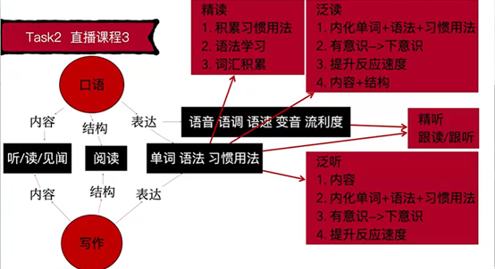

* task0 开班
1. 雅思托福课教什么?
	 1. 英语阅读与听力的关系
		 精读+泛读
		 精听+泛听
		 阅读+听力+写作+口语的关系
	 2. 如何提升效率?
			目的和效率意识+相同的时间做到的事情更多.
	 3. Learning how to learn
	 4. Critical Thinking
2. 英语目标:
	如果考试拿个C1,实际使用只有B2的水平,因为实际比考试情况复杂.
3. 学习时间:
	B2:500-600小时
	C1:700-800小时
4. 要每天进行task0.5,断断续续效率极低; 因为英语没到B2应用级别,没用.

** Habit
要每天进行task0.5,断断续续效率极低; 因为英语没到B2应用级别,没用.

** 对英语学习的帮助?
对于真正掌握英语有一个明确的目标,以及完成这个目标需要的时间.
** 如何提升?
1. 设立英语目标为C1
2. 准备好适当的学习时间
	 20240715: 720小时

* task1 工具准备 humans of newyork
1. 跟读只跟美音,听力所有都听不限于英美音.
2. https://humansofnewyork.com/archive
	 精读+精听的材料,用来提升听力+口语(最新的,所以最好)
3. 读懂一切英语文本
	 1. 单词:
			查字典:发音+含义(只查文中含义,英汉均看)+例句(用法)+搭配collocation(用于造句:用法)
			欧陆词典:朗文+牛津
			注意:不懂就查,遇到忘记了继续查,直到记住不用查.不要背,背一次4分钟,查30次才30秒.
	 2. 语法
			查书:NCE23+C12+PEU(用索引查)
			Grammarly + AI
	 3. 习惯用法
			查: Google或bing xxx meaning
			单词语法都认识,理解不通,大概率是习惯用法
4. 造句后用grammarly纠正错误
	 自己判断正确错误以及修改的能力
5. 跟读前对比下GPT翻译的中文一句一句对比
6. 每一遍edge跟读任何文本
	 
** how
精读+精听: 
what: 前期:NCE123,后期:humans of NewYork
why: 提升听力和口语
how:
	 1. 查单词(欧陆)+语法(C12+PEU)+习惯用法(Google/Bing)
	 2. 摘抄单词+习惯用法,并造句*3
			1. 如何摘抄习惯用法
				 单词语法都认识,理解不通,大概率是习惯用法
			2. 如何造句
				 1. v+v.变化
				 2. 四句型转换
				 3. 方式/地点/时间
				 4. 其他习惯用法
				 5. 其他单词+词性
				 6. 原文+变
				 7. 6123456
				 8. 结合其他语法
	 3. 用Grammarly检查造句
	 4. 跟读前对比下GPT翻译的中文一句一句对比
	 5. 跟读50遍(真人>edge)
	 6. Ask questions(可选)
	 7. 摘要写作(可选)
	 8. tell the story(可选)

** habit
1. 非英美音也同样听,不要挑听力材料,印度+黑人+日本+中国口音都听.
2. 把C12给补全来
3. 求人先求己

* task2 习惯用法+英语学习框架
1. 输入 vs 输出
	 1. 输入多少是没用,只看能输出多少.不会输出就是没学会,只是你自己产生错觉.以为自己会
	 2. 输入了之后要赶紧输出
			eg.把造句大声朗读
2. 
	 ,Ti: 显示org图片
	 
	 内容:最核心,缺少内容给你钱都不想听.想象下英语国企开会
	 结构:简单.2-3天
	 表达:容易误以为自己只有表达不好
	 口语VS写作:前者多了语音,后者多了拼写
	 Task0.5提升内容和表达
	 泛读:
		 1.内化:看得多了,就内化了.开始翻译成汉语,开始不得不这样,阅读足够多,就不会了.
		 2.英语用结构表达虚拟语气:熟练读从0-几(需要告诉自己什么结构是虚拟语气),几-万次(直接反应过来).由原来要想到想都不用想,要想就慢了.
			 如何下意识?熟能生巧.
		 3.反应速度:快慢是结果,阅读量大就快,小就慢;不需要专门练
	 语音++:
		 语音:单词发音
		 语调:模仿自然会出来
		 变音:?
		 语速:快慢是结果,不需要专门练
		 流利度:顺畅
	 跟听:盯着歌词听音乐生怕丢了.
		 什么时候用?嘴巴太累或不方便的时候.
		 和跟读一样以精读为基础
	 泛听:
		 eg:汉语学的雾霾
	 初期大量听力+阅读的时候,已经在提升口语和写作.!!!
	 没有阅读+听力,无法提升口语+写作,无法空中楼阁.
3. 如何摘抄单词+句型+习惯用法,并造句?
	 1. 如何摘抄单词+句型+习惯用法?
			1. 表达比你好?
				 例如:人固有一死,或重于泰山,或死于鸿毛.
				 谈起一睡前:话一样,我不会说.你说半天,别人一句话就解释清楚了.
			2. 真不会(初期)
			3. 模仿Leo的新概念2-3怎么摘的
					先自己摘抄,再对比Leo摘抄的
			4. 习惯用法造句+单独文本文件记录
	 2. 造句
			四句型+2+345+其他单词+其他习惯用法+语法
	 3. 用于何处?
			1. 读书破万卷,下笔如有神. 写作
			2. 腹有诗书气自华. 口语
4. Grammarly/AI检查句子 + 文章/NCE23造句指南
	1.造句靠指南提升的很快,但无法100%
 	2.大语法结构错了一定扣分
	3.AI:Is this right? 造句到后面只有几个句子.
	4.表达容易修改,自己修改能提升自己
5. 效果VS效率
	1.效果和效率的区别?
	每天进步就行了,慢有什么关系???效率
	两个月也能到. 能两小时到,为什么要两个月到?
	不要问Leo有没有效果,问有没有效率?
	2.如何提升效率?
	一个方法解决多个问题.
	看不懂文章也能得满分?也不要学它,因为要用英语解决现实的问题.
 
* task3 0-1 习惯用法+工具使用+英语学习框架复习
1. 入门时莫凡事均疑
2. 进度条思维:
	 做事情当时间拉得足够长时,要有进步条思维.把焦虑感转变成积累进步的喜悦
3. 莫要苛求完美的工具,够用就好.差生和大师文具多.
	 eg. Edge已经够跟读,不用再苛求更好的AI语音.
4. 英语听说读写密不可分,需要齐头并进.
5. 母语者也仅仅是语法大结构不会弄错,不用苛求语法
6. 长难句的解决
	 1. 读:拆成短句+学NCE2+3+best life
	 2. 听:多跟读
	 3. 写:精读+跟读
	 4. 说:精读+跟读
7. 口语复述: tell the story,提升阅读+听力时,口语也会一直提升.
8. Art of Public Speaking
	 摘抄习惯用法:
	 1. 细心
		 eg. for which he had been nominated
			 be nominated for
	 2. NCE3先自己摘,再对比Leo摘抄的
9. 对抗焦虑
	 1. 调整时间
	 2. 心态调整CBT
			自己骂自己傻逼,自己不会反击.别人指责自己的,会反击.
			CBT把自己和自己的想法隔离开了.
			引起自己的焦虑的话写下来. 把这些当作自己最讨厌的人说的. 对抗减少焦虑
	 3. 每周三次有氧运动,半个小时
	 4. 冥想: 堵车和红绿灯都可以冥想. 素材:学英语看世界(公众号)
	 5. 睡眠: 如何提升睡眠质量(附加值)
	 6. 营养:
			- 氧气(学累了走走)
			- 卡路里(杂粮+加餐[全麦+坚果干果+燕麦+香蕉])
	 7. 寻求亲朋好友的支持: 不说风凉话,别拆台;给物质的支持
	 8. 正确对待压力: 肌肉是撸完铁之后增长的,没有压力干活没效率,压力太久直接萎靡.
				应该是间歇性周期性的压力
	 9. 娱乐休闲计划: 干完这事后,做电脑面前很放松
	 10. 雅思进度条: 初期养成习惯
	 11. 问题+解决问题的意愿+研究能力=对任何话题的理解超过大多数人
10. 练雅思听力第一题的方法: 精读+跟读真题

* task4 1-1 听力
1. The Learning Pyramid: 1-4 input 5-7 output
	 1. Lecture 5% 上课只有老师讲
	 2. Reading 10% 有文字
	 3. Audio Visual 20% 有图示
	 4. Demonstration 30% 实战演习
	 5. Discussion Group 50% 小组讨论
	 6. Practice by Doing 75% 通过做去练
	 7. Teach Others 90% 教别人
2. 该题跟读50遍后
	 7 -> 10: 在该题上,英语水平大幅提升
	 是否真的读懂?还是产生了幻觉?: 用chatgpt翻译成中文,对比自己的理解
	 过嘴不过脑: 每一遍带着个目的去读
	 拼写?: 跟中文一样同样有不会写的字.多造句+多写作.即便是拼写不行也可以拿雅思8.5.
3. 听力要拿多少分?为什么7分(30/40)不可以?听写怎么样?
	 听力至少要8分(听懂80-90%).
	 7分大部分内容没听,因为要实际听别人讲话.
	 有效果没效率.
4. 听力的sub-skills
	 - 复述: 同义词+同义习惯用法+同义句型(听力问题+听力脚本)
		 精读解决
	 - 口音: 只听纯英式,纯美式? 只跟读纯英,纯美式?
		 都听; 只跟读一种,塑造自己的语音
	 - 单词+语法+习惯用法
	 - 单词拼写
		 自然拼读法则+造句+多写忘掉的单词
	 - 语音+语调+语速
		 跟读
	 - 变音:两个方案回顾?:
		 学发音规则不搞,只跟读.
5. 听力提升=(精读+精听:解决subskills)+泛听
	 模拟对话? 难度已经不够了.
6. 强者改变,弱者抱怨

* task5 2-1 听力满分计划
1. 如果搜中文对应的英文表达,先google搜英文,再把搜到查下meaning看看对不对.
2. 公众号文章: 雅思改版 和 小组讨论事项
3. 复利:
	 - 拐点:复利在到达拐点之前,长时间的增长速度极慢.
	 - 拐点及雅思7:
		 理论上: 雅思到C1的水平要700-800小时,折算3-6个月,为什么很多人努力3-6月达不到?
		 - 3-6个月需要每天学习10小时,不打水分的10小时
		 - 拐点的存在
		 - 学习如逆水行舟,断断续续地学没倒退就不错了
	 - task0.5: 全部符合复利
		 1. 跟读至与录音速度一致(听力+口语+阅读)
				跟听初级尽量不跟听,少了口语
		 2. 精读(积累单词+语法+习惯用法=听说读写)
		 3. 习惯用法摘抄及造句(写作+口语)
		 4. 内容(写作+口语)
4. 听力为什么要满分?
	 1. 学习+工作+聊天
	 2. 获取信息差,利用信息差省钱甚至赚钱
5. 听力满分计划: 从跟读文章1到跟读文章N的复利,达到听力满分
	 文章N是多少? 在不跟读的前提下,几乎拿起来就能读,除了少数磕绊
	 1. NCE123 + C12 (阅读+写+跟读)
	 2. TED-Ed (阅读+跟读)
	 3. Learning how to learn()
			- 下载script
			- 跟读教授
			- coursera VS 真题: 多了内容,可以和雅思考官聊这个
6. 进度条思维
	 进行长期任务时,把未完成的焦虑感转变成积累进步的喜悦.
		eg. 精读script时,不要为自己不认识的单词而焦虑,为自己有认识的而喜悦,因为表达又提升了一点
** how
- 跟读到和录音速度一致,后期可以跟听
- 精读+跟读NCE123
- 精读+跟读TED-Ed
- 没东西读时,读下NCE保持下语感
	
* task6 3-1 泛读泛听 What Why How
1. 考试逻辑: 考试考的是熟练
	 根: 精读(会) + 泛读(熟练)
   树干: sub-skills
   树叶: 答题技巧 + 考试技巧
   答题技巧+考试技巧: 依赖于精读泛读;但是效率低,因为不能解决英语使用的问题
   sub-skills: 也依赖于精读泛读
2. 精读: 无限时间肯定能读懂.
	 what? 获取表达为主,每句话都懂
	 why? 所有的英语学习的基础
	 how? task1的how
	 因为先会再熟的原则,精读是泛读的基础.
3. 泛读: 熟练
	 what? 获取内容为主,不必每句话都懂
	 why? 效率高+motivation+大部头恐惧+重复带来的速度提升
	 how? 有用+有趣+本科难度
4. 泛听: 熟练表达(语音)
	 what?
	 why? 获取内容+增加重复
	 how? 必须先会,再熟
		比例变化: 1%->99%
		降噪+被动学习: 
		知识信息+娱乐:
	 1. 精读过的音频
	 2. 本科教材+Edge语音
	 3. 美剧
	 4. podcast
	 5. audiobook
	 6. coursera+udemy+etc.

* task7 3-2 阅读subskills
1. 阅读的sub-skills?
	 1. word guessing
	 2. 单词+语法+习惯用法=句子 (会+熟练)
	 3. Paraphrasing: 同义单词+同义习惯用法+同义句型
	 4. 表句子/词关系&层次的单词 [写作+口语]
	 5. 段首 & 段尾
	 6. Skimming: main ideas [why? how?]
	 7. scanning: find specific info. [why? how?]
	 8. Features of a reading passage
	 9. 连续阅读1.5h
	 10. 注意力集中meditation [英语+内容]
* task8 4-1 泛读实战1 西方文明简史
* task9 5-1 泛读实战2 教育心理学
* task10 6-1 泛读实战3 critical thinking
* task11 6-2 写作1 what why how
* task12 7-1 写作2 开始介绍+task2
* task13 7-2 写作3 task2+task1
* task14 8-1 口语1+口语2 实战演练
* task15 8-2 方案整合 降维打击1
