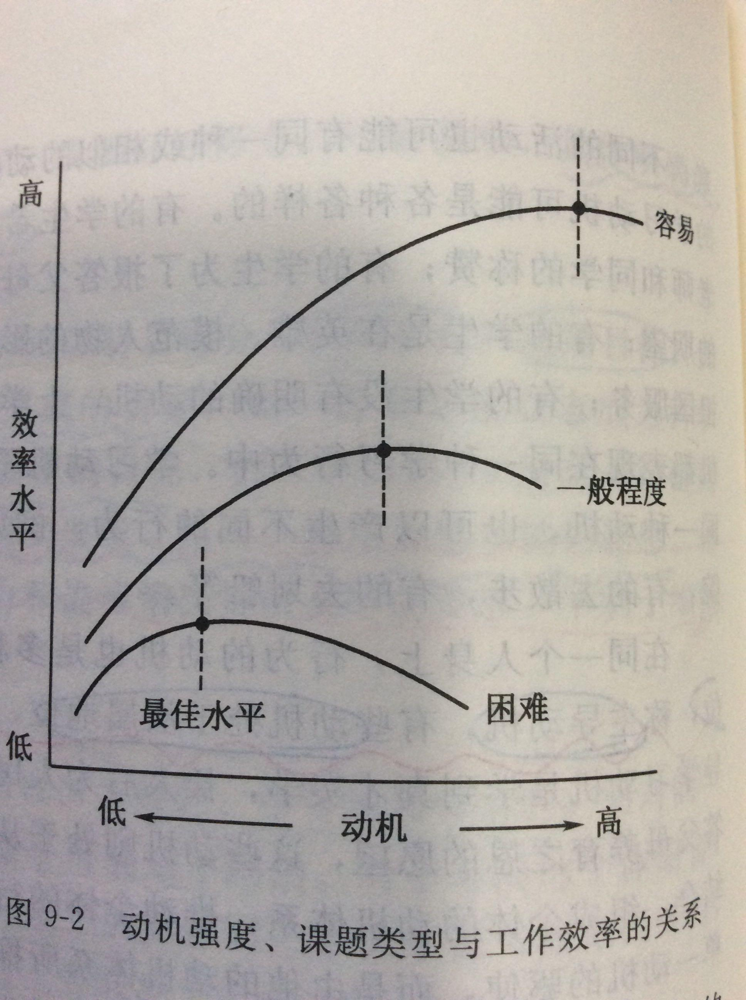

为什么说「太用力的人走不远」？

和墨菲定律没关系，和耶基斯-多德森定律有关。
耶基斯多德森定律，是指1.动机强度和工作效率之间的关系，不是线性关系，而是呈倒U型曲线的。2.不同的任务难度中影响工作效率的动机水平也有所不同。
先解释第一点：在中等难度的任务中，动机水平维持中等程度是最佳的。
过高的动机水平引起焦虑等不良情绪，从而影响问题解决的能力；而过低的动机水平又不足以唤起个体。因此，实验证明，中等水平强度的动机，最有利于中等程度任务的完成。
第二点，找到了个图
看图就知道，在实验中发现，越困难越复杂的任务维持较低的动机水平是更有利于任务的完成，而越简单的任务则需要较高的动机水平来完成任务。

回到问题。
对爱情、友情的维系，对成功的渴望，这两件事虽然很笼统，但是如果我说这都属于比较困难复杂的任务，应该也不会有太多的异议。
那么这些困难的任务根据这个定律，我们应该维持一个较低的动机水平。而过高的动机水平则会使得工作效率大幅下降，从而导致任务的失败。
“太用力”大约指的就是过高的动机水平了。
——————————————————6.30的更新————－——————————

补充解释一下"动机"的意思
动机指推动个体活动并使活动朝向某一目标的内部动力。是一个概括性术语，概括了所有引起、支配和维持生理和心理活动的内部过程。
而动机的基础是人类的各种需要。
生理性的需要，例如进食、性、睡觉等等
社会性的需要，例如劳动、社交、婚恋、安全感、自尊、自我实现等
还有物质需要，金钱、食物等，相对应的精神需要，求知等。

1. 动机强度与工作效率呈倒U字型关系.
2. 越困难的任务,相对其动机水平应该越低.
----------------------------------------

因为每一步的局部最优，无法带来全局最优。
以学钢琴为例：
如果你极度在意每一天、每节课的效果和效率，完全不能容忍一点浪费和损耗，恨不得每一分钟都要发挥出它最大的价值才行。但是就算是天才，也不可能没有一点的浪费啊，更何况普通人呢？不能接纳“浪费”，最后往往用不了多久，就会身心俱疲，而且会心生猜忌，最终以放弃告终。
如果你能合理接纳自己的不完美，能接纳自己有的时候“状态不好”“效率不高”“表现不满意”，能接纳一定的“浪费”，不过度苛责自己，不精神内耗和心理反刍，不在乎短期的得失，一直保持着松弛平和的状态，那么，这样反而能走得很远。
